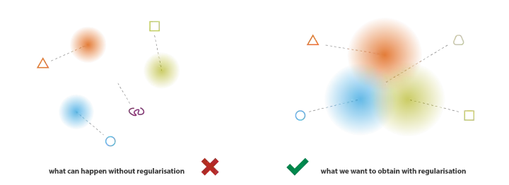
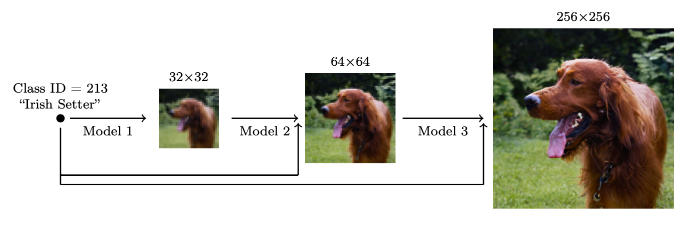

## 1. PixelCNN
PixelCNN是DeepMind在2016年推出的自回归生成模型。

### 训练
- 通过最大化训练数据的似然估计（交叉熵）来学习其参数：
$$\argmax_{\theta}\sum_{i=1}^{n}\log f(x_i|\theta)$$

- 可以并行学习图像中所有像素的分布，但是需要用带掩码的卷积，阻止来自尚未预测的像素的信息流。

### 推理
- PixelCNN是自回归模型，其推断也是顺序的，必须逐个像素地生成。
- 模型的输出经过一个softmax函数后，通过多项分布采样（$torch.multinominal$）生成下一个像素值。

### 应用
- 语音、视频、图像生成。
- 学习概率分布：VQ-VAE中，用PixelCNN学习latent codes的先验分布$p(z)$，从先验中抽样喂入decoder，就可以生成新的图像。PixelCNN输出digits的数量对应VQ-VAE的embedding空间（或称codebook）所包含的离散embedding的数量。

## 2. VAE
AutoEncoder用无监督的方式学习高维数据的压缩和重建，其功能类似于PCA。AutoEncoder容易过拟合，在其基础上，又发展了Denoising AutoEncoder，Sparse AutoEncoder，Contractive AutoEncoder，增加更多约束，避免过拟合，增强健壮性。
但是AutoEncoder将输入映射到潜空间中固定的向量，而无法用于产生新的内容。VAE是一种特殊的AutoEncoder，在训练的过程同通过正则化避免过拟合，并确保潜空间具有连续性（空间上的相近的点生成的结果应该有某种相似性）和完备性（潜空间中的任意一点都应该能生成有意义的结果）。将输入编码成概率分布而不是特定点，可以自然地体现潜空间的正则化：编码器返回的分布被强制逼近一个标准正态分布。

### 训练
通过一个高斯分布$q_x(z)=N(g(x),h(x))$来拟合后验分布$p(z|x)$，使用变分推理可以得到目标方程为：
$$(f^*,g^*,h^*)=\argmax_{(f,g,h)\in F\times G \times H}(E_{z\sim q_x}(-\frac{||x-f(z)||^2}{2c})-KL(q_x (z),p(z)))$$

从直觉上理解，目标方程包含两部分：x和$f(z)$之间的重建误差，$q_x(z)$和$p(z)$（标准正态分布）之间的KL散度。c是超参数，控制两项之间的平衡。

### 推理
从先验分布$z\sim N(0,1)$中抽样送入decoder即可得到新的图像。

### 应用
- 压缩表示、数据降维
- 图像生成

## VQ-VAE(Vector Quantised-Variational AutoEncoder)
VAE学习一个连续的潜空间，VQ-VAE则是学习一个离散的潜空间。之所以需要一个离散的潜空间，原因如下：
1. 现实世界中的很多数据更接近于离散表示。人类的语言可以表示为一个个音节，图像也可以用一些离散的要素来描述，颜色、物体类型、尺寸等等。
2. 很多的算法是针对离散数据设计的，如transformer。
VQ-VAE在AutoEncoder的基础上，增加了codebook。编码器的输出被映射为codebook中与其欧氏距离最短的那个向量，并将这个新的向量作为decoder的输入：
$$z_q(x)=Quantize(E(x))=e_k\ where\ k=\argmin_{i}||E(x)-e_i||_2$$

### 训练
因为$argmin()$不可微，反向传播时decoder输入$z_q$的梯度直接复制给encoder的输出$z_e$。此外，VA-VAE还优化：
1. VQ loss：embedding空间与encoder输出之间的L2误差。
2. Commitment loss：让encoder的输出尽可能靠近embedding空间，避免在不同向量之间来回跳动。

$$
L = \underbrace{\|\mathbf{x} - D(\mathbf{e}_k)\|_2^2}_{\textrm{reconstruction loss}} + 
\underbrace{\|\text{sg}[E(\mathbf{x})] - \mathbf{e}_k\|_2^2}_{\textrm{VQ loss}} + 
\underbrace{\beta \|E(\mathbf{x}) - \text{sg}[\mathbf{e}_k]\|_2^2}_{\textrm{commitment loss}}
$$
式中，$sq[.]$是stop_gradient操作符。

### 推理
为了生成新数据，VQ-VAE还需要额外学习一个新的先验$p(z)$，如果学习到的先验能够准确反映离散的latent codes的分布，就可以通过从先验中抽样，然后将样本作为decoder的输入，来生成新的数据。

### 应用
- 语音、音乐、图像（DALL-E）、视频生成
- Disentanglement
- 在BEiT中被用作tokenizer

## diffusion
扩散模型受到非平衡热力学的启发，定义了一个模拟扩散过程的马尔科夫链，将随机噪声逐步添加到数据中，再学习逆转扩散过程来重建原始数据。

- 前向过程

前向过程通过超参数$\{\beta_t\in(0,1)\}_{t=1}^T$进行调控，并且$\beta_1<\beta_2<···<\beta_T$。

$$
q(\mathbf{x}_t \vert \mathbf{x}_{t-1}) = \mathcal{N}(\mathbf{x}_t; \sqrt{1 - \beta_t} \mathbf{x}_{t-1}, \beta_t\mathbf{I}) \quad
q(\mathbf{x}_{1:T} \vert \mathbf{x}_0) = \prod^T_{t=1} q(\mathbf{x}_t \vert \mathbf{x}_{t-1})
$$

当$T\rightarrow\infty$，$\mathbf{x}_T$成为各向同性的高斯分布。对于任何一个时序$t$，$\mathbf{x}_t$都可以直接通过一次抽样得到。令$\alpha_t=1-\beta_t,\bar{\alpha_t}=\prod^t_{i=1}\alpha_i$，
$$
\begin{aligned}
\mathbf{x}_t 
&= \sqrt{\alpha_t}\mathbf{x}_{t-1} + \sqrt{1 - \alpha_t}\boldsymbol{\epsilon}_{t-1} & \text{ ;where } \boldsymbol{\epsilon}_{t-1}, \boldsymbol{\epsilon}_{t-2}, \dots \sim \mathcal{N}(\mathbf{0}, \mathbf{I}) \\
&= \sqrt{\alpha_t \alpha_{t-1}} \mathbf{x}_{t-2} + \sqrt{1 - \alpha_t \alpha_{t-1}} \bar{\boldsymbol{\epsilon}}_{t-2} & \text{ ;where } \bar{\boldsymbol{\epsilon}}_{t-2} \text{ merges two Gaussians (*).} \\
&= \dots \\
&= \sqrt{\bar{\alpha}_t}\mathbf{x}_0 + \sqrt{1 - \bar{\alpha}_t}\boldsymbol{\epsilon} \\
q(\mathbf{x}_t \vert \mathbf{x}_0) &= \mathcal{N}(\mathbf{x}_t; \sqrt{\bar{\alpha}_t} \mathbf{x}_0, (1 - \bar{\alpha}_t)\mathbf{I})
\end{aligned}
$$

- 反向过程

$q(\mathbf{x}_{t-1}|\mathbf{x}_t)$同样是高斯分布，但$q(\mathbf{x}_{t-1}|\mathbf{x}_t)$无法直接计算，因而需要学习一个模型$p_\theta$来拟合这些条件概率：
$$
p_\theta(\mathbf{x}_{0:T}) = p(\mathbf{x}_T) \prod^T_{t=1} p_\theta(\mathbf{x}_{t-1} \vert \mathbf{x}_t) \quad
p_\theta(\mathbf{x}_{t-1} \vert \mathbf{x}_t) = \mathcal{N}(\mathbf{x}_{t-1}; \boldsymbol{\mu}_\theta(\mathbf{x}_t, t), \boldsymbol{\Sigma}_\theta(\mathbf{x}_t, t))
$$
值得注意的是，当反向条件概率以给定$\mathbf{x}_0$为条件时，可以进行计算：
$$
q(\mathbf{x}_{t-1} \vert \mathbf{x}_t, \mathbf{x}_0) = \mathcal{N}(\mathbf{x}_{t-1}; \color{blue}{\tilde{\boldsymbol{\mu}}}(\mathbf{x}_t, \mathbf{x}_0), \color{red}{\tilde{\beta}_t} \mathbf{I})
$$
其中，
$$
\begin{aligned}
\tilde{\beta}_t 
&= \color{green}{\frac{1 - \bar{\alpha}_{t-1}}{1 - \bar{\alpha}_t} \cdot \beta_t} \\
\tilde{\boldsymbol{\mu}}_t (\mathbf{x}_t, \mathbf{x}_0)

&= \color{cyan}{\frac{1}{\sqrt{\alpha_t}} \Big( \mathbf{x}_t - \frac{1 - \alpha_t}{\sqrt{1 - \bar{\alpha}_t}} \boldsymbol{\epsilon}_t \Big)}\\
\end{aligned}
$$

利用贝叶斯定理和变分下限，可以推出待优化的负对数似然：
$$
\begin{aligned}
- \log p_\theta(\mathbf{x}_0) 
&\leq - \log p_\theta(\mathbf{x}_0) + D_\text{KL}(q(\mathbf{x}_{1:T}\vert\mathbf{x}_0) \| p_\theta(\mathbf{x}_{1:T}\vert\mathbf{x}_0) ) \\
&= \mathbb{E}_q \Big[ \log \frac{q(\mathbf{x}_{1:T}\vert\mathbf{x}_0)}{p_\theta(\mathbf{x}_{0:T})} \Big] \\
\text{Let }L_\text{VLB} 
&= \mathbb{E}_{q(\mathbf{x}_{0:T})} \Big[ \log \frac{q(\mathbf{x}_{1:T}\vert\mathbf{x}_0)}{p_\theta(\mathbf{x}_{0:T})} \Big] \geq - \mathbb{E}_{q(\mathbf{x}_0)} \log p_\theta(\mathbf{x}_0)
\end{aligned}
$$
进一步推导可以得到：
$$
\begin{aligned}
L_\text{VLB} &= L_T + L_{T-1} + \dots + L_0 \\
\text{where } L_T &= D_\text{KL}(q(\mathbf{x}_T \vert \mathbf{x}_0) \parallel p_\theta(\mathbf{x}_T)) \\
L_t &= D_\text{KL}(q(\mathbf{x}_t \vert \mathbf{x}_{t+1}, \mathbf{x}_0) \parallel p_\theta(\mathbf{x}_t \vert\mathbf{x}_{t+1})) \text{ for }1 \leq t \leq T-1 \\
L_0 &= - \log p_\theta(\mathbf{x}_0 \vert \mathbf{x}_1)
\end{aligned}
$$

### 训练
问题可以简化为，根据时序$t$的输入$\mathbf{x}_t$，用模型预测噪声$\epsilon_t$，
$$
\begin{aligned}
\boldsymbol{\mu}_\theta(\mathbf{x}_t, t) &= \color{cyan}{\frac{1}{\sqrt{\alpha_t}} \Big( \mathbf{x}_t - \frac{1 - \alpha_t}{\sqrt{1 - \bar{\alpha}_t}} \boldsymbol{\epsilon}_\theta(\mathbf{x}_t, t) \Big)} \\
\text{Thus }\mathbf{x}_{t-1} &= \mathcal{N}(\mathbf{x}_{t-1}; \frac{1}{\sqrt{\alpha_t}} \Big( \mathbf{x}_t - \frac{1 - \alpha_t}{\sqrt{1 - \bar{\alpha}_t}} \boldsymbol{\epsilon}_\theta(\mathbf{x}_t, t) \Big), \boldsymbol{\Sigma}_\theta(\mathbf{x}_t, t))
\end{aligned}
$$
DDPM没有对方差进行训练，而是使用了固定方差$\Sigma_\theta(\mathbf{x}_t,t)=\tilde{\beta_t}I$。

一个简化版的目标方程可以写成：
$$
\begin{aligned}
L_t^\text{simple}
&= \mathbb{E}_{t \sim [1, T], \mathbf{x}_0, \boldsymbol{\epsilon}_t} \Big[\|\boldsymbol{\epsilon}_t - \boldsymbol{\epsilon}_\theta(\mathbf{x}_t, t)\|^2 \Big] \\
&= \mathbb{E}_{t \sim [1, T], \mathbf{x}_0, \boldsymbol{\epsilon}_t} \Big[\|\boldsymbol{\epsilon}_t - \boldsymbol{\epsilon}_\theta(\sqrt{\bar{\alpha}_t}\mathbf{x}_0 + \sqrt{1 - \bar{\alpha}_t}\boldsymbol{\epsilon}_t, t)\|^2 \Big]
\end{aligned}
$$
整个训练过程的算法如下：

### 推理
用训练完成的模型抽样生成数据的算法如下：

### 改进
后续的改进主要包括：
#### 1.$\beta_t$的参数设定
DDPM设定的前向方差是一系列线性增加的常数，$\beta_1=10^{-4}\ to\ \beta_T=0.02$。改进工作提出了余弦型的方差规划。规划函数的选取可以是任意的，只要它在训练的中段变化接近线性，而在$t=0$和$t=T$附近变化趋缓。
$$
\beta_t = \text{clip}(1-\frac{\bar{\alpha}_t}{\bar{\alpha}_{t-1}}, 0.999) \quad\bar{\alpha}_t = \frac{f(t)}{f(0)}\quad\text{where }f(t)=\cos\Big(\frac{t/T+s}{1+s}\cdot\frac{\pi}{2}\Big)
$$

#### 2. 反向过程方差$\Sigma_\theta$的参数化
DDPM将$\beta_t$设置为不可学习的常数项，并且令$\Sigma_\theta(\mathbf{x}_t,t)=\sigma_t^2I$，$\sigma_t^2$同样不可学习，而且等于$\beta_t$或$\tilde{\beta_t}=\frac{1-\bar{\alpha}_{t-1}}{1-\bar{\alpha}_t}\cdot\beta_t$。改进工作提出通过让模型预测一个混合向量$\mathbf{v}$，来学习$\beta_t$和$\tilde{\beta_t}$之间的一个插值，作为$\Sigma_\theta(\mathbf{x}_t,t)$：
$$
\boldsymbol{\Sigma}_\theta(\mathbf{x}_t, t) = \exp(\mathbf{v} \log \beta_t + (1-\mathbf{v}) \log \tilde{\beta}_t)
$$

#### 3. 加速sampling
前向过程的步数T作为DDPM的重要超参数，T越大，反向过程越接近高斯分布，用高斯分布近似生成过程越能取得更好的效果。所以T的取值一般很大，DDPM采用$T=1000$。但是要进行一次sampling，需要T次迭代，且不能并行，导致sampling速度很慢。改进的工作包括：strided sampling，denoising diffusion implicit model (DDIM)，Latent diffusion model (LDM）。

#### 4.引导生成
用一些类标签或描述性文字来引导样本生成。
##### 4.1 Classifier Guided Diffusion
对一个已训练好的diffusion模型，为了将类别信息显性地引入扩散过程，首先训练一个针对噪声图像$\mathbf{x}_t$的分类器$f_\phi(y \vert \mathbf{x}_t, t)$，然后利用梯度$\nabla_\mathbf{x} \log f_\phi(y \vert \mathbf{x}_t)$来引导sampling过程朝向指定条件$y$（例如目标类标签）。这是因为加入引导时的条件分布$p_{\theta,\phi}(x_t|x_{t+1},y)$近似服从高斯分布，与无引导下的条件分布$p_{\theta}(x_t|x_{t+1})$相比，仅仅相当于将均值移动了$\Sigma g,\ where\ g=\nabla_{x_t}\log{p_\phi(y|x_t)}$。权重$s$用以平衡样本的逼真程度和多样性。

##### 4.2 Classifier-Free Guidance
在没有一个独立的分类器$f_\phi$的情况下，我们用同一个神经网络同时学习$p_\theta(\mathbf{x})$和$p_\theta(\mathbf{x}|y)$。训练时随机摒弃引导信息$y$，从而使模型也能够学习到如何在没有引导的情况下生成图像。一个隐式分类器的梯度可以用引导和非引导下的模型结果表示。

#### 5.分辨率提升
通过级联的多个扩散模型提升最终生成图像的分辨率：

### 应用
- 语音、音乐、图像（DALL-E2, Imagen）生成

## Score-based models
给定样本集$\{\mathbf{x}_1, \mathbf{x}_2, \cdots, \mathbf{x}_N\}$，其中的每个数据都是从潜在的分布$p(\mathbf{x})$抽样得到，生成模型的目标就是根据样本拟合数据分布。令$f_\theta(\mathbf{x}) \in \mathbb{R}$是以$\theta$为参数的实值函数，定义一个概率密度函数：

$$
\begin{align} p_\theta(\mathbf{x}) = \frac{e^{-f_\theta(\mathbf{x})}}{Z_\theta}\end{align}
$$

$Z_\theta > 0$是配分函数，只和$\theta$有关。$f_\theta(\mathbf{x})$被称为energy-based model。可以通过最大化似然函数学习$p(\mathbf{x})$：

$$
\begin{align} \max_\theta \sum_{i=1}^N \log p_\theta(\mathbf{x}_i)\end{align}
$$ 

但$Z_\theta$通常无法直接求解或计算复杂。定义分布$p(\mathbf{x})$的**score function**为：

$$
\begin{equation} \nabla_\mathbf{x} \log p(\mathbf{x}) \notag \end{equation}
$$

用以拟合score function的模型$\mathbf{s}_\theta(\mathbf{x})$被称为**score-based model**。

$$
\begin{equation} \mathbf{s}_\theta (\mathbf{x}) = \nabla_{\mathbf{x}} \log p_\theta (\mathbf{x} ) = -\nabla_{\mathbf{x}} f_\theta (\mathbf{x}) - \underbrace{\nabla_\mathbf{x} \log Z_\theta}_{=0} = -\nabla_\mathbf{x} f_\theta(\mathbf{x}). \end{equation}
$$

可见$\mathbf{s}_\theta(\mathbf{x})$与$Z_\theta$无关。
与最大似然类似，可以通过最小化模型与数据分布的Fisher divergence训练score-based model：

$$
\begin{equation} \mathbb{E}_{p(\mathbf{x})}[\| \nabla_\mathbf{x} \log p(\mathbf{x}) - \mathbf{s}_\theta(\mathbf{x}) \|_2^2]\end{equation}
$$

Fisher divergence不能直接计算，因为$\nabla_\mathbf{x} \log p(\mathbf{x})$未知，通过score matching可以得到一个等效的目标方程：

$$
\mathbb{E}_{p_\text{data}}\bigg[\operatorname{tr}( \nabla_{\mathbf{x}}^2 \log p_\theta(\mathbf{x})) + \frac{1}{2} \| \nabla_\mathbf{x} \log p_\theta(\mathbf{x})\|_2^2 \bigg]
$$
式中，$\nabla_\mathbf{x}^2$是关于$\mathbf{x}$的Hessian矩阵。

一旦模型训练完成，可以通过**Langevin dynamics**进行采样。Langevin dynamics提供了一种利用score function $\nabla_\mathbf{x} \log p(\mathbf{x})$完成从分布$p(\mathbf{x})$采样的方法。首先从任意的先验分布$\mathbf{x}_0 \sim \pi(\mathbf{x})$完成初始化，后续的迭代过程如下：
$$
\begin{align} \mathbf{x}_{i+1} \gets \mathbf{x}_i + \epsilon \nabla_\mathbf{x} \log p(\mathbf{x}) + \sqrt{2\epsilon}~ \mathbf{z}_i, \quad i=0,1,\cdots, K\end{align}
$$
式中，$\mathbf{z}_i \sim \mathcal{N}(0, I)$，当$\epsilon \to 0\ and\ K \to \infty$时，$\mathbf{x}_K$收敛到$p(\mathbf{x})$的一个样本。

一个关键的挑战是，在空间中数据密度低的区域，我们估计的score function并不准确，因为这些区域只有很少的数据点供我们计算score matching的目标方程。特别当我们采用Langevin dynamics进行抽样，初始样本极有可能落在低密度区域，而且远离数据集，导致生成高质量样本非常困难。

解决上述问题，可以人为给数据点添加噪声，然后在噪声数据上训练score-based model，当噪声足够大，就可以扩散到低密度区域，从而增加估计score的准确性：

但是噪声过大，就会导致分布远离初始数据。为了平衡两者，可以同时采用多尺度的噪声。假设添加的噪声是各向同性的高斯噪声$\mathcal{N}(0, \sigma_i^2 I), i=1,2,\cdots,L$，标准差分别为$\sigma_1 < \sigma_2 < \cdots < \sigma_L$，加入噪声后的数据分布为：
$$
p_{\sigma_i}(\mathbf{x}) = \int p(\mathbf{y}) \mathcal{N}(\mathbf{x}; \mathbf{y}, \sigma_i^2 I) \mathrm{d} \mathbf{y}.
$$
从$p_{\sigma_i}(\mathbf{x})$抽样时可以先从$\mathbf{x} \sim p(\mathbf{x})$抽样，然后计算$\mathbf{x} + \sigma_i \mathbf{z}\ with\ \mathbf{z} \sim \mathcal{N}(0, I)$。

接着，我们训练一个噪声条件下的Score-Based Model $\mathbf{s}_\theta(\mathbf{x}, i)$，对每一个添加噪声后的分布估计score function $\nabla_\mathbf{x} \log p_{\sigma_i}(\mathbf{x})$。训练的目标方程是Fisher divergence的加权平均：
$$
\sum_{i=1}^L \lambda(i) \mathbb{E}_{p_{\sigma_i}(\mathbf{x})}[\| \nabla_\mathbf{x} \log p_{\sigma_i}(\mathbf{x}) - \mathbf{s}_\theta(\mathbf{x}, i) \|_2^2]
$$
$\lambda(i) \in \mathbb{R}_{>0}$是权重系数，通常选择$\lambda(i) = \sigma_i^2$。目标方程可以通过score matching进行优化。在模型$\mathbf{s}_\theta(\mathbf{x}, i)$训练完成后，可以通过依次在$i = L, L-1, \cdots, 1$上进行Langevin dynamics，这种方法被称为退火Langevin dynamics。

## StyleGAN
StyleGAN主体架构基于Progressive Growing GAN（PGGAN）。PGGAN为了提升GAN生成图像的质量、稳定性和多样性，在训练过程中，通过逐步向Generator和Discriminator添加卷积层，使得模型能够先学习到图像的总体结构，然后逐渐学习更多的细节。

StyleGAN首先将潜码$\mathbf{z}\in \mathcal{Z}$，经过非线性变换$f:\mathcal{Z}\rightarrow\mathcal{W}$，得到中间码$\mathbf{w}\in\mathcal{W}$（通常是和$\mathbf{z}$一样，长度为512的张量），非线性变换$f$是一个8层的MLP，$\mathbf{w}$经过仿射变换得到*风格*$\mathbf{y}=(\mathbf{y}_s,\mathbf{y}_b)$，并且在每一个卷积层之后，通过AdaIN（adaptive instance normalization）加入到Generator网络。*风格*决定了图像包含的元信息。

AdaIN来自风格迁移，起因是发现在进行Instance Normalization时：
$$
IN(x)=\gamma(\frac{x-\mu(x)}{\sigma(x)})+\beta\\
\mu_{nc}(x)=\frac{1}{HW}\sum_{h=1}^H\sum_{w=1}^W x_{nchw}\\
\sigma_{nc}(x)=\sqrt{\frac{1}{HW}\sum_{h=1}^H\sum_{w=1}^W(x_{nchw}-\mu_{nc}(x))^2+\epsilon}
$$
发现，公式中的$\gamma$和$\beta$代表了图像的风格，可以通过改变$\gamma$和$\beta$实现风格迁移。

在StyleGAN中，AdaIN操作定义如下：
$$
AdaIN(\mathbf{x}_i,\mathbf{y})=\mathbf{y}_{s,i}\frac{\mathbf{x}_i-\mu(\mathbf{x}_i)}{\sigma(\mathbf{x}_i)}+\mathbf{y}_{b,i}
$$
式中对每个特征图$\mathbf{x}_i$分别进行正则化，然后用*风格*$\mathbf{y}$的对应分量进行缩放和偏置。

为使Genenrator能生成具有随机性的细节，如雀斑、发际线位置等，引入了显式的噪声输入。这些噪声在每个卷积层后进行添加，是一些单通道的高斯噪声图，噪声图先乘上需要学习的缩放系数，然后分别添加到对应的特征图中。

StyleGAN还简化了传统的输入层，代之以在一个需要学习的$4\times 4\times 512$的常数张量上开始图像生成。

为了进一步解耦*风格*各要素对图像生成的影响，训练时采用了风格混合（style mixing）的技术。在生成网络上随机选择一个节点，分别用两个潜码$\mathbf{z}_1,\ \mathbf{z}_2$变换得到两个中间码$\mathbf{w}_1,\ \mathbf{w}_2$，在节点之前，用$\mathbf{w}_1$控制图像风格，此后则切换到$\mathbf{w}_2$，这样可以防止模型认为相邻的风格是相关的。

由于StyleGAN的中间潜空间$\mathcal{W}$具有解耦合、易操控的良好特性，可以训练一个额外的encoder将真实图像映射到$\mathcal{W}$空间，从而实现语义编辑和引导生成，如tediGAN：

StyleGAN的generator的每一层代表着不同的属性，改变相应层的*风格*输入，就可以实现对相应属性的修改：

| n-th attribute | n-th attribute |
| --- | --- |
| 1 eye glasses | 7 hair color |
| 2 head pose | 8 face color |
| 3 face shape | 9 age |
| 4 hair length, nose, lip | 10 gender |
| 5 cheekbones | 11 micro features |
| 6 chin | 12 micro features |

## DCTransformer
在频率域进行图像生成。首先把图像转化为YCbCr色彩空间，并对Cb和Cr通道进行2×的下采样，分别将各个通道划分为一定大小（8×8）的区块，然后对所有区块进行DCT变换，并离散化（quantization，通过与quantization matrix逐元素相除并取整），将变换后的区块按照之字形拉直为向量，并按照相应的空间位置排列成DCT图像，然后将DCT图像的非零元素稀疏表示为（DCT通道，空间位置，值）的列表，对Y，Cb，Cr进行相同操作，并且在通道方向上连接。

